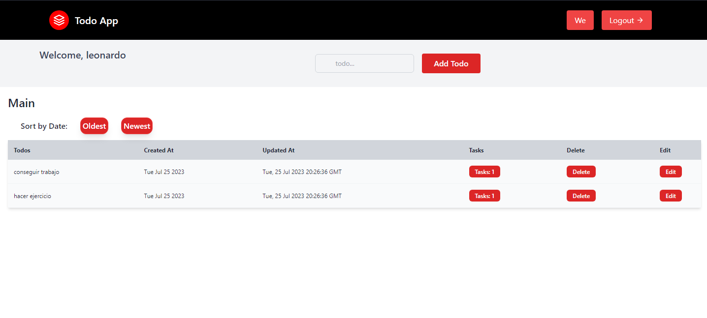

# Fullstack Todo App

Una aplicación de lista de tareas simple y fácil de usar que te ayuda a mantenerte organizado y al tanto de tus tareas diarias.

## Acerca de la Aplicación

La Fullstack Todo App es una aplicación web diseñada para ayudar a los usuarios a organizar sus tareas diarias y mantenerse productivos. Permite a los usuarios crear, editar y eliminar tareas, así como agregar y gestionar tareas individuales dentro de cada tarea. La aplicación ofrece una interfaz limpia e intuitiva, lo que facilita a los usuarios mantenerse al día con sus tareas.

## Tecnologías Utilizadas

La Fullstack Todo App está construida utilizando las siguientes tecnologías:

- MongoDB: La aplicación utiliza MongoDB como base de datos para almacenar tareas, lo que proporciona una solución de almacenamiento escalable y eficiente.

- Node.js: El backend de la aplicación está construido utilizando Node.js, que proporciona un entorno de ejecución rápido y liviano para ejecutar JavaScript en el lado del servidor.

- ReactJS: El frontend de la aplicación está desarrollado utilizando ReactJS, una popular biblioteca de JavaScript para construir interfaces de usuario.

- Express.js: Express.js se utiliza como el framework de backend para crear un servidor robusto y escalable para manejar las solicitudes de la API y gestionar la autenticación de usuarios.

- Tailwind CSS: La aplicación utiliza Tailwind CSS para el diseño, lo que permite un desarrollo rápido y consistente de la interfaz de usuario.

- JWT Tokens: Para la autenticación de usuarios, la aplicación utiliza JWT (JSON Web Tokens) para gestionar de manera segura las sesiones de usuario y autorizar ciertas rutas.

## Cómo Usar la Aplicación

1. Clona el repositorio y navega hasta el directorio del proyecto.

2. Ejecuta el servidor frontend:
   - Ve a la carpeta "client" con el comando `cd client`.
   - Instala los paquetes requeridos con `npm install`.
   - Inicia el servidor frontend con `npm start`.

3. Ejecuta el servidor backend:
   - Ve a la carpeta "server" con el comando `cd server`.
   - Instala los paquetes requeridos con `npm install`.
   - Inicia el servidor backend con `npm run dev`.

4. Una vez que ambos servidores frontend y backend estén en funcionamiento, puedes acceder a la aplicación en tu navegador web.

